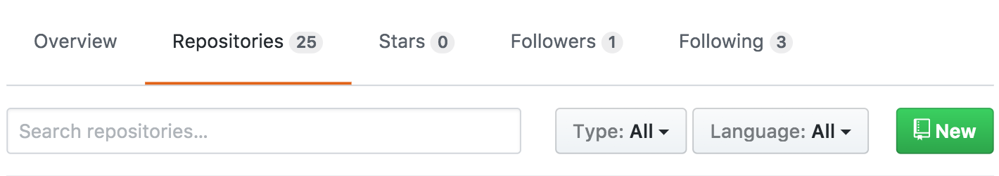

Getting started with GitHub
========================================================
author: Lucas Nell
date: 11 Oct 2017
autosize: true
font-family: Helvetica Neue
css: custom.css


<small>`lucasnell.com/github_gsis`</small>


Why use git and GitHub?
========================================================
left: 50%


***

- Collaborating with a team
- Sharing code with strangers
- Tracing and avoiding horrible mistakes


git and GitHub overview
========================================================


Today's goals
========================================================

1. Tell git who you are
2. Connect securely to GitHub
3. Create a test repository
4. Clone, commit, and push your repository


Prerequisites
========================================================

- git
- GitHub account
- R and RStudio


Telling git who you are
========================================================

In RStudio, `Tools` > `Shell...`

Set global defaults for name and email.
Make sure the email below is the one you use for your GitHub account


```bash
git config --global user.name 'John Doe'
git config --global user.email 'john@doe.com'
```

Checking global git options
========================================================
title: false
Output from this command...

```bash
git config --global --list
```
... should include this:

```bash
user.name=John Doe
user.email=john@doe.com
```


Connecting securely to GitHub using SSH
========================================================

First, check if you already have an SSH key

From R:

```r
file.exists("~/.ssh/id_rsa.pub")
# Windows:
# file.exists("C:/Users/USERNAME/.ssh/id_rsa")
```

If `FALSE`, you need to make a public key first...

Making and viewing key
==========


<small>from `http://r-pkgs.had.co.nz/git.html#git-init`</small>

Adding key to GitHub
====================

Login to `github.com` in web browser

Go to `https://github.com/settings/ssh`


Enter a descriptive title (e.g., "Personal MacBook Pro")

Paste your key into the "Key" box


Initiate new repository
========================================================

<div>
From <code>github.com</code>:

</div>

From profile page:




Describe and create new repository
========================================================


Clone repository in RStudio
========================================================

`File` > `New Project` > `Version Control` > `Git`


Make local changes
========================================================

If just using a test repo, edit the `README.md` file and save changes.

If wanting to move a directory over to GitHub, copy those files into the 
new repository's folder


Commit and Push
========================================================


- Under "Git" tab, checked "Staged" for file(s) that you changed or added
- Hit "Commit"
- Add useful commit message
- Hit "Commit" again

If the above works, then you're successfully using GitHub through RStudio


Additional resources
========================================================
class: smaller

- Source of info for much of this presentation: `happygitwithr.com`
- For connecting to GitHub using SSH: `r-pkgs.had.co.nz/git.html`
- Simple command line guide: `rogerdudler.github.io/git-guide`
- GitHub Education (for free private repos): `education.github.com`
- Recommended git clients (RStudio isn't great to use long-term)
    - GitKraken: `gitkraken.com`
    - SourceTree: `sourcetreeapp.com`
- If you can't connect to GitHub through RStudio, use the command line:
`happygitwithr.com/push-pull-github`


> This presentation is available at `lucasnell.com/github_gsis`
