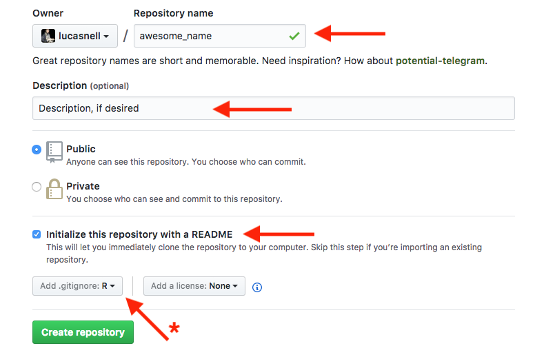

Getting started with GitHub
========================================================
author: Lucas Nell
date: 11 Oct 2017
autosize: true
font-family: Helvetica Neue


<small>`lucasnell.com/github_gsis`</small>


Goals
========================================================

1. Connect git to GitHub
2. Connect GitHub to RStudio
3. Familiarize with creating repositories
4. Do all the primary command line stuff now so you don't have to later


Prerequisites
========================================================

- git
- GitHub account
- R and RStudio


Setting global git options
========================================================

In RStudio, `Tools` > `Shell...`

Set global defaults for name and email.
Make sure the email below is the one you use for your GitHub account


```bash
git config --global user.name 'John Doe'
git config --global user.email 'john@doe.com'
```

Output from this command...

```bash
git config --global --list
```
... should include this:

```bash
user.name=John Doe
user.email=john@doe.com
```


Connecting securely to GitHub using SSH
========================================================

First, check if you already have an SSH key

From R:

```r
file.exists("~/.ssh/id_rsa.pub")
# Windows:
# file.exists("C:/Users/USERNAME/.ssh/id_rsa")
```

If `FALSE`, you need to make a public key first...

Making and viewing key
==========


<small>from `http://r-pkgs.had.co.nz/git.html#git-init`</small>

Adding key to GitHub
====================

Login to `github.com` in web browser

Go to `https://github.com/settings/ssh`


Enter a descriptive title (e.g., "Personal MacBook Pro")

Paste your key into the "Key" box


Initiate new repository
========================================================

<div>
From <code>github.com</code>:

</div>

From profile page:


Describe and create new repository
========================================================




Clone repository in RStudio
========================================================

`File` > `New Project` > `Version Control` > `Git`


Make local changes
========================================================

If just using a test repo, edit the `README.md` file and save changes.

If wanting to move a directory over to GitHub, copy those files into the 
new repository's folder


Commit and Push
========================================================


- Under "Git" tab, checked "Staged" for file(s) that you changed or added
- Hit "Commit"
- Add _useful_ commit message
<div align="left">

</div>
- Hit "Commit"


<!-- Credits -->
<!-- ======================================================== -->

<!--  -->

<!--  -->

<!-- - [GitKraken](https://www.gitkraken.com/) -->
<!-- - [SourceTree](http://www.sourcetreeapp.com/) -->


<!-- Connecting to GitHub through command line:  -->
<!-- `http://happygitwithr.com/push-pull-github.html` -->


<!-- 'https://image.slidesharecdn.com/2-git-dag-150928235519-lva1-app6891/95/2-git-dag-14-638.jpg' -->
